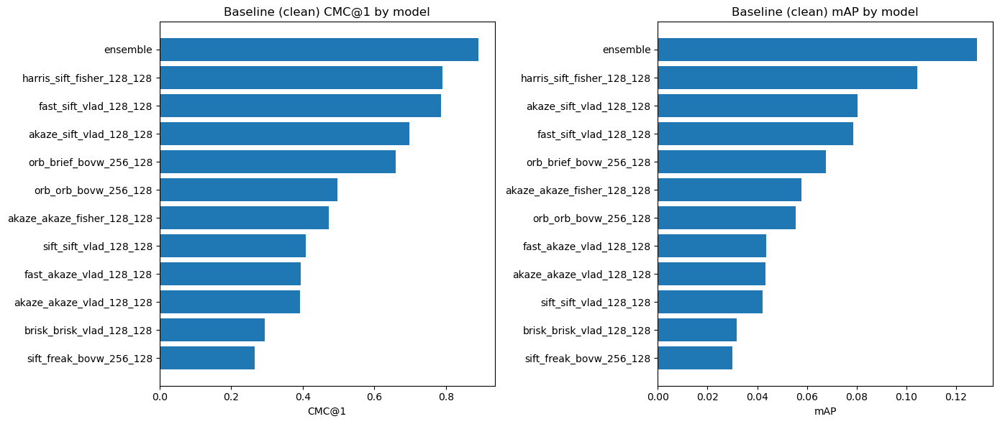
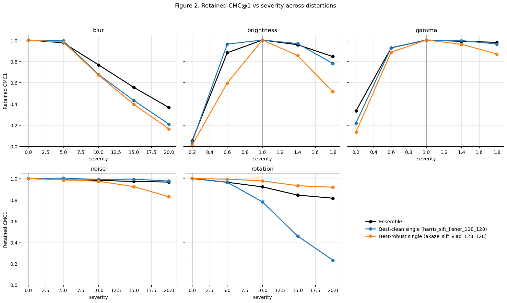
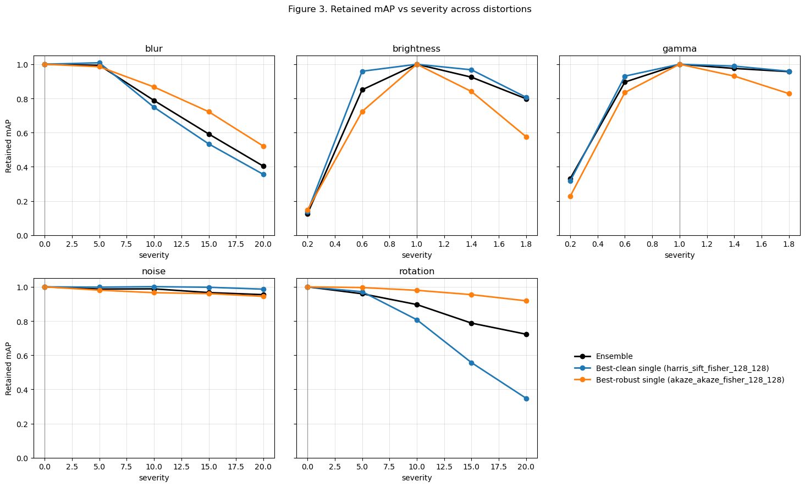
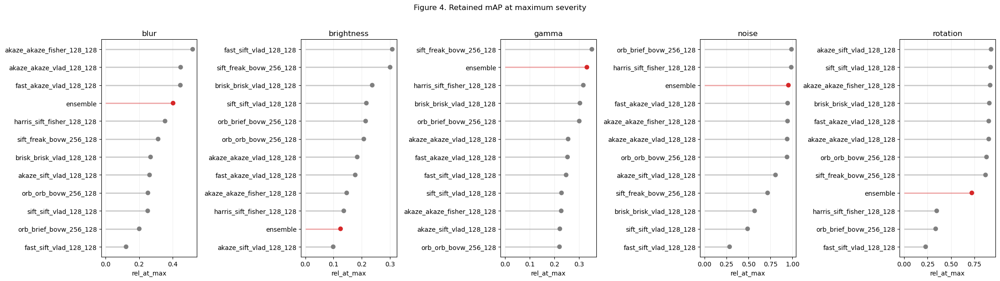
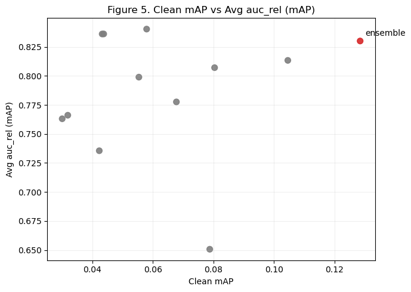
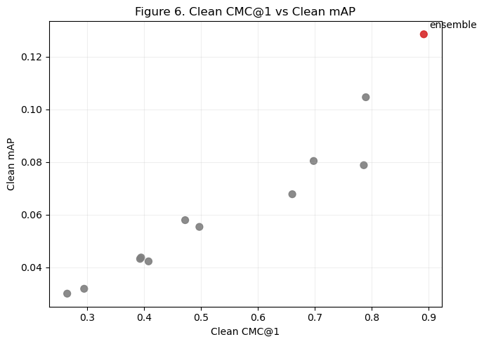
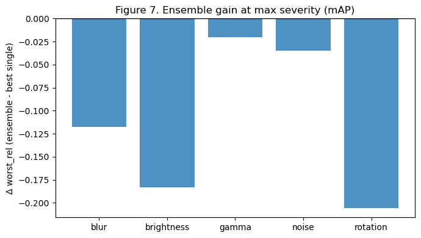

# Robust Vehicle ReID via Keypoint Ensembles Under Query Distortions

**Models:** 11 keypoint methods + 1 ensemble (12 total)  

**Metrics (reported):**  
- *Top-k retrieval (operational):* CMC@1/5/10, AP@5/10  
- *Ranking consistency (tail-sensitive):* mAP, mINP  

**Distortions (query-side):** blur, brightness, gamma, noise, rotation  
- blur/noise/rotation: 4 severity levels  
- brightness/gamma: 2 darker + 2 brighter (4 total)

---

## Abstract (TL;DR)
We benchmark **11 traditional keypoint-based** vehicle ReID methods and *an ensemble* on VeRI under five query distortions (blur, noise, rotation, brightness, gamma) with multiple severities. Most single methods achieve usable top-k retrieval (CMC/AP@k) but very low mAP/mINP due to viewpoint-driven long-tail ranking failures. The **ensemble performs best** on clean top-k metrics **(CMC@1=0.8915)** and improves clean **mAP (0.1284)**, while offering the strongest average robustness for CMC@1 across distortions. Brightness changes are the main failure mode for all models, causing the most severe degradation, and mAP robustness remains challenging even with ensembling.

[Benchmark Result Link](https://docs.google.com/spreadsheets/d/1ch98ICPhnnGXTW6pvMtVRzLaYY-60x4TLOlAL2NI-js/edit?usp=sharing)
---

## 1. Introduction
Vehicle ReID systems deployed in real surveillance settings face distortions such as motion blur, noise, rotation perturbations, and illumination changes.
Traditional keypoint-based methods can often retrieve the correct identity within the top ranks but may fail on challenging viewpoint changes, leading to poor global ranking quality.

**Contributions**
1. A controlled query distortion benchmark across five augmentation families with multiple severity levels.
2. Robustness quantification using retained-performance summaries (worst-case, AUC retained, sensitivity slope).
3. Ensemble-centric analysis: where ensembling helps, where it does not, and robustness/accuracy trade-offs.

---

## 2. Benchmark Setup

### 2.1 Dataset and evaluation protocol
- Dataset name / source: VeRI
- #identities (IDs): 200
- #query images: 1678
- #gallery images: 9901
- Similarity metric: dot

### 2.2 Models
- Keypoint methods (11)  *TODO: add traditional models to appendix*
- Ensemble (1)  *TODO: add methodology of ensemble model to appendix*
- Compute setting: Since these are all traditional methods and not vectorized, all is compute with CPU, with the exception of the ensemble one where the backbone that choose keypoint methods to use is a CNN. 

### 2.3 Query distortions
Distortions are applied to the query set only.

**Table 1. Distortion settings**
| Augmentation | Severity levels | Parameterization | Notes |
|---|---:|---|---|
| blur | 4 | kernel size | motion/out-of-focus blur |
| noise | 4 | standard deviation | sensor/compression noise |
| rotation | 4 | degree | camera tilt / pose shift |
| brightness | 4 | factor | 2 darker + 2 brighter |
| gamma | 4 | 1/y | 2 darker + 2 brighter |

---

## 3. Metrics

### 3.1 Top-k retrieval (operational)
We report CMC@1/5/10 and AP@5/10 to reflect practical shortlist retrieval performance.

### 3.2 Ranking consistency (tail-sensitive)
We report mAP and mINP, which penalize long-tail failures and reflect ranking consistency across all queries.

### 3.3 Why CMC/AP@k can be high while mAP/mINP are low
Most keypoint-based methods retrieve the correct identity within the top ranks for many queries, leading to high CMC/AP@k.
However, viewpoint changes (e.g., front vs rear vs side) can significantly alter keypoint configurations and descriptors, causing a subset of queries to rank the true match very poorly.
Because mAP and mINP are sensitive to these hard-query failures and depend on the full ranking list, they can remain low even when top-k metrics are usable.

---

## 4. Robustness Evaluation

### 4.1 Retained-performance curves
Let `y0` be the clean baseline performance and `y(s)` be performance at normalized severity `s`.
We define retained performance as `rel(s) = y(s) / y0`.

### 4.2 Robustness summary statistics (per model × augmentation)
From the retained-performance curve, we compute:

- `baseline`: `y0` (clean performance)
- `n_points`: number of severity levels
- `rel_at_max`: retained % at strongest severity
- `abs_drop_max`: `y0 - y(max)`
- `rel_drop_max`: `(y0 - y(max)) / y0`
- `mean_rel_drop`: average relative drop across severities
- `worst_rel`: worst retained % among severities
- `auc_rel`: average retained % across severity range [0,1]
- `slope_rel`: sensitivity (more negative = more sensitive)

We use **mAP** as the primary metric for ranking-consistency robustness, and **CMC@1** as a primary operational robustness metric.

---

## 5. Results

### 5.1 Clean-set performance

**Table 2a. Clean performance (top-k retrieval)**
| Model | CMC@1 | CMC@5 | CMC@10 | AP@5 | AP@10 |
|---|---:|---:|---:|---:|---:|
| ensemble | **0.8915** | **0.9535** | **0.9749** | **0.8836** | **0.8321** |
| akaze_akaze_fisher_128_128 | 0.4719 | 0.6704 | 0.7449 | 0.5220 | 0.4934 |
| akaze_akaze_vlad_128_128 | 0.3927 | 0.5840 | 0.6799 | 0.4444 | 0.4238 |
| akaze_sift_vlad_128_128 | 0.6978 | 0.8224 | 0.8605 | 0.7134 | 0.6711 |
| brisk_brisk_vlad_128_128 | 0.2943 | 0.4755 | 0.5697 | 0.3436 | 0.3350 |
| fast_akaze_vlad_128_128 | 0.3945 | 0.5858 | 0.6806 | 0.4475 | 0.4256 |
| fast_sift_vlad_128_128 | 0.7861 | 0.8909 | 0.9249 | 0.7927 | 0.7425 |
| harris_sift_fisher_128_128 | 0.7896 | 0.9058 | 0.9410 | 0.8005 | 0.7463 |
| orb_brief_bovw_256_128 | 0.6603 | 0.7956 | 0.8528 | 0.6820 | 0.6427 |
| orb_orb_bovw_256_128 | 0.4970 | 0.6722 | 0.7580 | 0.5342 | 0.5053 |
| sift_freak_bovw_256_128 | 0.2646 | 0.4464 | 0.5310 | 0.3192 | 0.3107 |
| sift_sift_vlad_128_128 | 0.4076 | 0.6043 | 0.6794 | 0.4613 | 0.4369 |

**Table 2b. Clean performance (ranking consistency)**
| Model | mAP | mINP |
|---|---:|---:|
| ensemble | **0.1284** | **0.0070** |
| akaze_akaze_fisher_128_128 | 0.0579 | 0.0067 |
| akaze_akaze_vlad_128_128 | 0.0432 | 0.0064 |
| akaze_sift_vlad_128_128 | 0.0803 | 0.0064 |
| brisk_brisk_vlad_128_128 | 0.0318 | 0.0063 |
| fast_akaze_vlad_128_128 | 0.0437 | 0.0064 |
| fast_sift_vlad_128_128 | 0.0787 | 0.0064 |
| harris_sift_fisher_128_128 | 0.1045 | 0.0075 |
| orb_brief_bovw_256_128 | 0.0677 | 0.0063 |
| orb_orb_bovw_256_128 | 0.0553 | 0.0064 |
| sift_freak_bovw_256_128 | 0.0300 | 0.0063 |
| sift_sift_vlad_128_128 | 0.0422 | 0.0063 |

**Key observations**
- Ensemble vs best single (clean mAP): Δ = 0.0239
- Ensemble vs best single (clean CMC@1): Δ = 0.1019
- mAP/mINP remain low for most keypoint methods due to viewpoint-driven tail failures.

  

---

### 5.2 Robustness curves (ensemble focus)

  

  

**Most harmful distortions:**
- For the **ensemble**, the **most harmful** distortion is **brightness**: lowest auc_rel and lowest rel_at_max for both CMC1 (auc_rel≈0.7216, rel_at_max≈0.0501) and mAP (auc_rel≈0.7249, rel_at_max≈0.1249).
- The **steepest sensitivity** (most negative slope_rel) for the ensemble is *blur* for both metrics (CMC1 slope_rel≈-0.6754, mAP slope_rel≈-0.6381), performance drops fastest as blur severity increases.
- The **least harmful** is **noise** (ensemble auc_rel≈0.98, rel_at_max≈0.95–0.97), with rotation generally next-best.

**Ensemble advantages:**
- **Top-k stability (retained CMC1):** ensemble is best on average across distortions (mean auc_rel≈0.8338, mean rel_at_max≈0.5059) vs best-clean single (≈0.7805, ≈0.3348) and best-robust single (≈0.7866, ≈0.4111).
- **Ranking consistency (retained mAP):** ensemble is close, but the best-robust single is slightly better on average (mean auc_rel≈0.8403, mean rel_at_max≈0.5515) than the ensemble (≈0.8301, ≈0.5073).

Ensemble method clearly stabilizes CMC@1 under blur/gamma/rotation and especially prevents catastrophic drops relative to average keypoints, but mAP robustness is not uniquely dominated by the ensemble; one strong single model can match/beat it on average retained mAP.

---

### 5.3 Robustness summary tables

**Table 3a. Robustness summary (CMC@1)**

| Model                      | blur auc_rel | blur worst_rel | noise auc_rel | noise worst_rel | rot auc_rel | rot worst_rel | bright auc_rel | bright worst_rel | gamma auc_rel | gamma worst_rel | avg_auc_rel |
| -------------------------- | -----------: | -------------: | ------------: | --------------: | ----------: | ------------: | -------------: | ---------------: | ------------: | --------------: | ----------: |
| ensemble                   |   **0.7447** |     **0.3650** |        0.9816 |          0.9666 |      0.9093 |        0.8148 |         0.7216 |           0.0501 |    **0.8117** |      **0.3329** |  **0.8338** |
| akaze_akaze_fisher_128_128 |       0.7334 |         0.3245 |        0.9471 |          0.9078 |      0.9279 |        0.8523 |         0.6070 |           0.0189 |        0.6837 |          0.0543 |      0.7798 |
| akaze_akaze_vlad_128_128   |       0.6992 |         0.2504 |        0.9757 |          0.8604 |      0.9439 |        0.8270 |         0.5542 |           0.0182 |        0.6847 |          0.0789 |      0.7715 |
| akaze_sift_vlad_128_128    |       0.6572 |         0.1640 |        0.9501 |          0.8284 |  **0.9658** |    **0.9180** |         0.6149 |           0.0102 |        0.7451 |          0.1349 |      0.7866 |
| brisk_brisk_vlad_128_128   |       0.3755 |         0.0526 |        0.7508 |          0.3097 |      0.8778 |        0.7794 |         0.5562 |           0.0243 |        0.6402 |          0.0749 |      0.6401 |
| fast_akaze_vlad_128_128    |       0.7051 |         0.2568 |        0.9770 |          0.8761 |      0.9498 |        0.8338 |         0.5604 |           0.0181 |        0.6892 |          0.0801 |      0.7763 |
| fast_sift_vlad_128_128     |       0.4274 |         0.0220 |        0.5061 |          0.1645 |      0.6306 |        0.1251 |     **0.7729** |       **0.2312** |        0.7633 |          0.1501 |      0.6201 |
| harris_sift_fisher_128_128 |       0.6762 |         0.2091 |        0.9942 |          0.9758 |      0.7049 |        0.2317 |         0.7415 |           0.0377 |        0.7855 |          0.2196 |      0.7805 |
| orb_brief_bovw_256_128     |       0.5549 |         0.0641 |    **1.0014** |      **0.9856** |      0.6480 |        0.1823 |         0.7225 |           0.0821 |        0.7629 |          0.1543 |      0.7379 |
| orb_orb_bovw_256_128       |       0.5022 |         0.0851 |        0.9601 |          0.8849 |      0.8972 |        0.8273 |         0.6436 |           0.0600 |        0.6879 |          0.0683 |      0.7382 |
| sift_freak_bovw_256_128    |       0.2652 |         0.0586 |        0.7821 |          0.5090 |      0.9009 |        0.7883 |         0.6166 |           0.0495 |        0.6976 |          0.0968 |      0.6525 |
| sift_sift_vlad_128_128     |       0.3620 |         0.0658 |        0.6531 |          0.2778 |      0.9322 |        0.8713 |         0.6144 |           0.0614 |        0.6700 |          0.0570 |      0.6463 |

**Table 3b. Robustness summary (mAP)**
| Model                      | blur auc_rel | blur worst_rel | noise auc_rel | noise worst_rel | rot auc_rel | rot worst_rel | bright auc_rel | bright worst_rel | gamma auc_rel | gamma worst_rel | avg_auc_rel |
| -------------------------- | -----------: | -------------: | ------------: | --------------: | ----------: | ------------: | -------------: | ---------------: | ------------: | --------------: | ----------: |
| ensemble                   |       0.7689 |         0.4035 |        0.9797 |          0.9543 |      0.8764 |        0.7229 |         0.7249 |           0.1249 |        0.8005 |          0.3310 |      0.8301 |
| akaze_akaze_fisher_128_128 |   **0.8337** |     **0.5208** |        0.9698 |          0.9443 |      0.9723 |        0.9183 |         0.6776 |           0.1468 |        0.7482 |          0.2274 |  **0.8403** |
| akaze_akaze_vlad_128_128   |       0.8005 |         0.4487 |        0.9875 |          0.9401 |      0.9658 |        0.9034 |         0.6720 |           0.1841 |        0.7547 |          0.2552 |      0.8361 |
| akaze_sift_vlad_128_128    |       0.7041 |         0.2626 |        0.9462 |          0.8074 |  **0.9748** |    **0.9284** |         0.6453 |           0.0989 |        0.7651 |          0.2218 |      0.8071 |
| brisk_brisk_vlad_128_128   |       0.5516 |         0.2686 |        0.8588 |          0.5696 |      0.9578 |        0.9097 |         0.7053 |           0.2373 |        0.7571 |          0.3029 |      0.7661 |
| fast_akaze_vlad_128_128    |       0.7994 |         0.4471 |        0.9882 |          0.9452 |      0.9675 |        0.9036 |         0.6702 |           0.1771 |        0.7554 |          0.2527 |      0.8362 |
| fast_sift_vlad_128_128     |       0.4812 |         0.1220 |        0.5648 |          0.2852 |      0.6543 |        0.2298 |     **0.7775** |       **0.3084** |        0.7754 |          0.2471 |      0.6507 |
| harris_sift_fisher_128_128 |       0.7420 |         0.3553 |        0.9976 |          0.9865 |      0.7525 |        0.3479 |         0.7657 |           0.1365 |    **0.8090** |          0.3166 |      0.8134 |
| orb_brief_bovw_256_128     |       0.6249 |         0.2007 |    **1.0020** |      **0.9891** |      0.7023 |        0.3369 |         0.7641 |           0.2139 |        0.7949 |          0.3002 |      0.7776 |
| orb_orb_bovw_256_128       |       0.6105 |         0.2528 |        0.9828 |          0.9384 |      0.9355 |        0.8797 |         0.7179 |           0.2075 |        0.7480 |          0.2204 |      0.7989 |
| sift_freak_bovw_256_128    |       0.4790 |         0.3138 |        0.8656 |          0.7175 |      0.9391 |        0.8692 |         0.7398 |           0.3008 |        0.7918 |      **0.3511** |      0.7631 |
| sift_sift_vlad_128_128     |       0.5231 |         0.2515 |        0.7605 |          0.4900 |      0.9565 |        0.9104 |         0.7040 |           0.2165 |        0.7335 |          0.2285 |      0.7355 |

  

---

### 5.4 Trade-off: accuracy vs robustness

  

  

---

### 5.5 Where the ensemble helps most
Despite strong clean performance, the ensemble does **not** provide the best worst-case robustness on mAP: for every augmentation type, the strongest single method retains more mAP at maximum severity (Table 4), with the largest gaps under **rotation** (Δ = −0.2055) and **brightness** (Δ = −0.1835). This suggests the current ensembling strategy improves average behavior and top-k stability, but the hardest tail cases dominating worst-case mAP are better handled by certain specialized single pipelines under extreme distortions.

**Table 4. Ensemble gain at max severity (mAP retained)**
| Augmentation | Best single worst_rel | Ensemble worst_rel | Δ (ens - best) |
|---|---:|---:|---:|
| blur | 0.5208 | 0.4035 | -0.1173 |
| noise | 0.9891 | 0.9543 | -0.0348 |
| rotation | 0.9284 | 0.7229 | -0.2055 |
| brightness | 0.3084 | 0.1249 | -0.1835 |
| gamma | 0.3511 | 0.3310 | -0.0202 |

**Table 5 (optional). Ensemble gain on AUC retained (mAP)**
| Augmentation | Best single auc_rel | Ensemble auc_rel | Δ (ens - best) |
|---|---:|---:|---:|
| blur | 0.8337 | 0.7689 | -0.0648 |
| noise | 1.0020 | 0.9797 | -0.0222 |
| rotation | 0.9748 | 0.8764 | -0.0985 |
| brightness | 0.7775 | 0.7249 | -0.0526 |
| gamma | 0.8090 | 0.8005 | -0.0085 |

  

---

## 6. Discussion

### 6.1 Practical implications
The results suggest two distinct “success criteria” depending on how the ReID system is used:
- **Shortlist retrieval / human-in-the-loop:** Most traditional keypoint methods already provide usable **CMC@1/5/10** and **AP@5/10** on clean data, meaning the correct identity is often present within the top few results. In this setting, improvements in CMC/AP@k translate directly to reduced manual search time. The ensemble provides a clear benefit here, achieving the best clean **CMC@1 (0.8915)** and **AP@10 (0.8321)**.

- **Fully automatic ranking / downstream automation:** When a system relies on the entire ranked list (e.g., automatic identity assignment, long-tail monitoring, or threshold-based alerting), **mAP/mINP** become more important. In our benchmark, mAP and mINP are uniformly low across traditional methods, consistent with the hypothesis that viewpoint changes create a long tail of “hard queries” where the true match is ranked poorly. The ensemble increases clean mAP from **0.1045 → 0.1284** (Δ=0.0239), but ranking consistency remains the main bottleneck compared to modern learned embeddings.

In practice, this suggests a reasonable deployment strategy:

- Use the **ensemble** when the goal is robust shortlist retrieval under typical camera degradations.
- If the application requires high global ranking consistency, keypoint-only pipelines should be treated as a baseline and complemented with learned viewpoint-invariant representations.

### 6.2 Robustness takeaways
**Most harmful distortions.**
Across both operational and ranking-consistency metrics, **brightness** is the most damaging distortion for the ensemble. It yields the lowest retention at maximum severity for both:

- **CMC@1:** auc_rel ≈ 0.7216, worst_rel ≈ 0.0501

- **mAP:** auc_rel ≈ 0.7249, worst_rel ≈ 0.1249

This indicates that extreme brightness shifts can cause catastrophic failures even when other distortions are handled reasonably well. A practical implication is that illumination handling (exposure control, preprocessing, or illumination-invariant features) is critical for stability.

**Sensitivity vs end-point damage (slope vs worst-case).**
The ensemble shows the steepest sensitivity under **blur** (most negative slope_rel for both CMC@1 and mAP), meaning performance drops quickly as blur increases. However, blur is not the worst end-point failure mode for the ensemble—brightness is. This distinction is useful operationally:

- blur is a “gradual degradation” risk (slope-driven)
- brightness is a “catastrophic failure” risk (worst-case-driven)

**Where the ensemble helps (and where it doesn’t).**
The ensemble’s clearest strength is **top-k stability** across distortions:

- Average robustness on CMC@1 is best among all methods **(avg_auc_rel = 0.8338)**.
- Noise is largely handled well by most methods, but the ensemble remains near-ceiling (**noise auc_rel ≈ 0.9816**, worst_rel ≈ 0.9666).
- Rotation is generally less harmful than brightness and blur, and the ensemble retains reasonable performance (rot auc_rel ≈ 0.9093 for CMC@1).

For **ranking consistency (mAP)**, the ensemble is strong but **not uniquely dominant**:

- A single method (akaze_akaze_fisher_128_128) has slightly higher a**vg_auc_rel on mAP (0.8403)** than the ensemble (**0.8301**).
- In worst-case retention (worst_rel), the ensemble is often not best (Table 4), indicating that ensembling as implemented improves average behavior and top-k robustness more than it fixes the hardest tail cases in mAP.

**Interpretation.**
This pattern is consistent with a pipeline where the ensemble boosts retrieval confidence for many queries (raising CMC/AP@k), but the underlying representation is still vulnerable to viewpoint-driven mismatches for a subset of hard queries, which continue to dominate mAP/mINP.

### 6.3 Limitations
- **Query-only distortions.** We distort queries while keeping the gallery clean. Real deployments may include distortion on both sides, which can amplify failure modes.

- **Limited severity sampling.** Each augmentation is evaluated at four severity levels. While sufficient for trend estimation (auc_rel, slope_rel), finer sampling could better capture nonlinear sensitivity.

- **Traditional method constraints.** Most methods rely on non-learned keypoint/descriptor pipelines and may not be optimized for viewpoint invariance, which likely limits achievable mAP/mINP on VeRI.

- **Ensemble design not optimized for robustness.** The ensemble uses a CNN-based selector/backbone but may not be explicitly trained for distortion robustness or viewpoint normalization. More targeted ensembling (e.g., distortion-aware weighting) could change the mAP robustness outcome.

---

## 7. Conclusion
1. **Keypoint-based pipelines deliver usable top-k retrieval but weak ranking consistency.** On VeRI, most traditional methods maintain reasonable CMC/AP@k, but exhibit very low mAP/mINP, consistent with long-tail ranking failures driven by viewpoint changes.

2. **The ensemble improves clean performance and stabilizes top-k robustness under distortions.** It achieves the best clean CMC@1 (**0.8915**) and improves clean mAP over the best single method (**0.1284 vs 0.1045**, Δ=0.0239). Under distortions, it provides the strongest average robustness for CMC@1 **(avg_auc_rel = 0.8338)**, indicating improved operational stability.

3. **Illumination is the critical failure mode; mAP robustness remains challenging.** Brightness changes cause the largest degradation for the ensemble (lowest AUC and worst retention), and the ensemble does not consistently dominate worst-case mAP retention compared to the strongest single method. Future work should focus on illumination handling and viewpoint-invariant representations, potentially with distortion-aware ensembling or learned embeddings.

**Future directions**

- Distortion-aware preprocessing (exposure normalization, gamma correction, denoising) before keypoint extraction.

- Distortion-aware ensemble weighting (predict distortion type/severity and reweight methods).

- Hybrid systems that combine keypoint cues with learned deep embeddings to improve mAP/mINP while preserving top-k stability.

